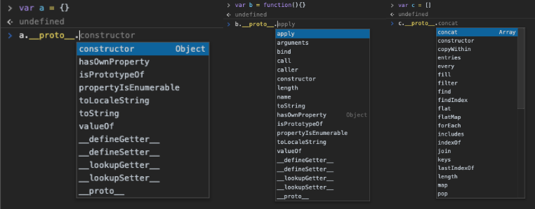

# Object-Oriented JavaScript and Prototypal Inheritance (Section 5)

> Inheritance:
  - One object gets access to the properties and methods of another object.
  - Classical Inheritance is the way it's been done for a long time (in C#, among others)
    * It is not necessarily a bad approach, it has been around for a long time and has been popular
    * It is very verbose and sometimes overly complex
  - Prototypal Inheritance is newer, and different than inheritance used in other programming languages.
    * Simple, flexible, and easier to understand than Classical Inheritance
    * The 'prototype' refers to the \__proto__ property inherent to all objects in JavaScript (obj.\__proto__)
    * A \__proto__ object can in turn have its own \__proto__ object, ad infinitum, creating a prototype chain.
    * If there is no property by the referenced name on the object itself, the JavaScript engine will go down the chain until it finds that property.
    * obj1 and obj2 are accessing the same properties through their \__proto__ objects, they occupy the same space in memory. 

    

> Everything is an Object (or a Primitive)
  - Node limits what can be seen logging the native methods of an object's prototype, but using the dev tools console you can see what the \__proto__ options are for an object, an array, and a function, like so:
  
    * many should be familiar, such push, keys, bind, etc.
    * `a.\__proto__.\__proto__` would return {}, but it does exist, as the chain is theoretically infinite

> Reflect and Extend
  - An object can look at itself, listing and changing its own properties and methods -- this is reflection, which enables extension
  - Using `_.extend(john, jane, jim)` triggers the createAssigner function in the Underscore.js [source code](https://underscorejs.org/docs/underscore.html#section-106)
    * passing more than one argument into _extend() causes the method to assign all of the properties of the arguments following the first one, to the first one.
    * IT looks at (reflects) the properties and methods of one or more objects and assigns (extends) them to the first object.
  - This is related to the keyword `extends` in newer JS, but the concept demonstrated here came first. 